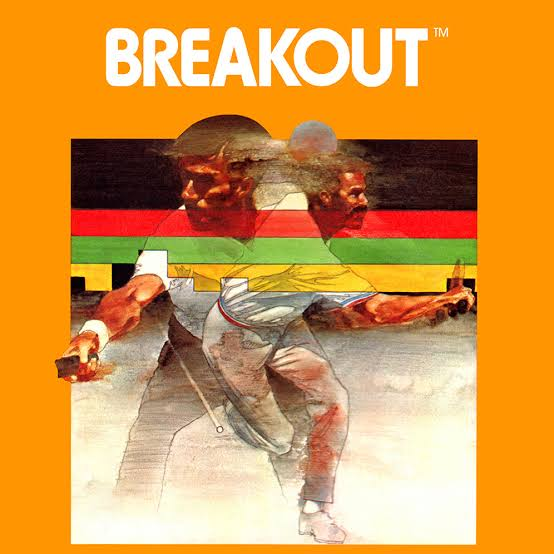

# American University | Spring 2025
## *Professor Mike Treanor, PhD, MFA*

## Description
In this course, students will produce many prototypes for 4 or 5 game genres. Different than a course that treats game development as a technical topic, this course will emphasize creating short and engaging gameplay prototypes with the goal of creating novel ideas that would support further development into more complete games. The focus of each class session will be to provide individual feedback on prototype quality, and the brainstorm new ideas.

## Assignments

| Assignment | Due |
| --- | --- |
| 0. [Environment setup](./assignments/setup.html) | 1-22-25 |
| 1.1. [Breakout 1](https://mtreanor.com/game615-spring2025/assignments/breakout.html#breakout-1) | 1-22-25 |
| 1.2. [Breakout 2a and 2b](https://mtreanor.com/game615-spring2025/assignments/breakout.html#breakout-2a-and-breakout-2b) | 1-29-25 |
| 1.3. [Breakout 3](https://mtreanor.com/game615-spring2025/assignments/breakout.html#breakout-3) | 2-5-24 |
| 1.4. [Final Breakout Prototype](https://mtreanor.com/game615-spring2025/assignments/breakout.html#final-prototype) | 2-12-24 |
| 1.5. [Reflection](https://mtreanor.com/game615-spring2025/assignments/breakout.html#reflection) | 2-12-24 |
| 2.1. [Platformer Analysis](https://mtreanor.com/game615-spring2025/assignments/platformer.html) | 2-19-24 |

## Examples

| Date | Topic | Code | Playable |
| --- | --- | --- | --- |
| 1-15-25 | Breakout - Unity Basics | [code](https://github.com/mtreanor/game615-spring2025/tree/main/examples/breakout/Assets/BallScriptRB.cs) | [play](./prototypes/breakout/) |
| 1-29-25 | Breakout - Custom Ball Physics | [code](https://github.com/mtreanor/game615-spring2025/tree/main/examples/breakout/Assets/BallPhysics.cs) | [play](./prototypes/breakout-physics/) |
| 2-5-25 | Breakout - Scaling time per object, trail renderer (with bloom), screen shake (with observer pattern / coroutines)  | [code](https://github.com/mtreanor/game615-spring2025/tree/main/examples/breakout/Assets/BallPhysics.cs) | [play](./prototypes/breakout-effects/) |