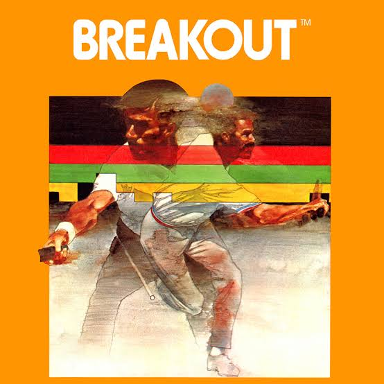
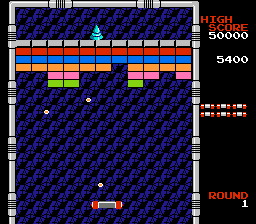

# Innovating with Breakout

<!--  -->

## breakout-1
*DUE: 1-22-25*



Create a small gameplay prototype based on Breakout.

Here are some things to keep in mind:
- try to make your prototype as engaging as possible
- your prototype should be arranged to explore and demonstrate the new gameplay features - you added (i.e. design levels that show your game in its best light)
- focus on gameplay rather than story or visual effects
- use abstract visuals (primitive shapes)
- think small!

In class, be prepared to: 
- playtest your game with your classmates
- answer the question "What is you prototype testing?"
- be prepared to receive critical feedback from your classmates
- share something interesting you learned about or used in order to make your prototype (share technical knowledge)

## breakout-2a and breakout-2b

*DUE: 1-29-25*



With a partner, create two more gameplay prototypes based on Breakout. As you consider your designs, strive to create gameplay that involves *something for the player to become good at* and a structure that gives the player the chance to learn to become skilled/good at playing your game. 

Additionally, incorporate at least one element of `polish` (as described in Game Feel) in at least one of the prototypes.

You may also consider creating series of small "levels" that introduce your game mechanic, and "train" a player to become skilled at playing your game (given the short amount of time, this may only be a couple of levels).

Your prototypes should be playable online (see instructions below).

## Submitting your prototypes

Build your prototype for "Web" and save the build in a folder named for each prototype: `breakout-1`, `breakout-2a`, `breakout-2b`, etc.

Your prototypes should be playble online by going to the following links:

```
http://<YOUR_GITHUB_USERNAME>.github.io/game-dev-spring2025/builds/breakout-1
http://<YOUR_GITHUB_USERNAME>.github.io/game-dev-spring2025/builds/breakout-2a
http://<YOUR_GITHUB_USERNAME>.github.io/game-dev-spring2025/builds/breakout-2b
```

If you need help getting your project on github, please refer to [these instructions](./setup.html). Most importantly, make sure to add the `.gitignore` file to your Unity project (if you are uploading your Unity project).