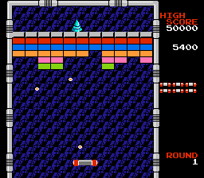
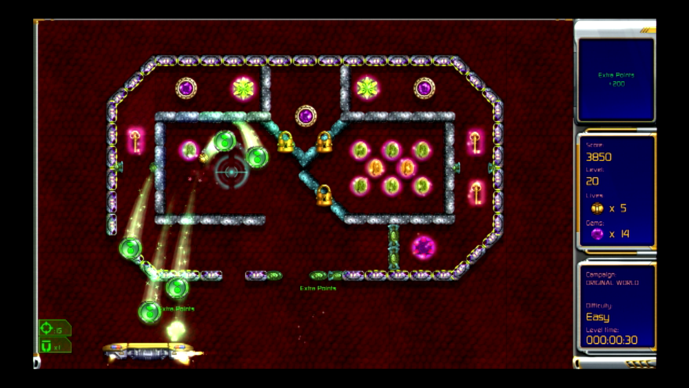

# Innovating with Breakout

## breakout-1
*DUE: 1-22-25*


Create a small gameplay prototype based on Breakout.

Here are some things to keep in mind:
- try to make your prototype as engaging as possible
- your prototype should be arranged to explore and demonstrate the new gameplay features - you added (i.e. design levels that show your game in its best light)
- focus on gameplay rather than story or visual effects
- use abstract visuals (primitive shapes)
- think small!

In class, be prepared to: 
- playtest your game with your classmates
- answer the question "What is you prototype testing?"
- be prepared to receive critical feedback from your classmates
- share something interesting you learned about or used in order to make your prototype (share technical knowledge)

## breakout-2a and breakout-2b

*DUE: 1-29-25*



With a partner, create two more gameplay prototypes based on Breakout. As you consider your designs, strive to create gameplay that involves *something for the player to become good at* and a structure that gives the player the chance to learn to become skilled/good at playing your game. 

Additionally, incorporate at least one element of `polish` (as described in Game Feel) in at least one of the prototypes.

You may also consider creating series of small "levels" that introduce your game mechanic, and "train" a player to become skilled at playing your game (given the short amount of time, this may only be a couple of levels).

Your prototypes should be playable online (see instructions below).

## breakout-3



Create, or refine, a prototype that can reliably entertain a player for **FIVE MINUTES** primarily through gameplay.

When designing your prototype, consider why people play games for a period of time. Here are some ideas:

- to gain mastery of a skill
- to solve a puzzle
- to see what happens when... (i.e. discover aspects of the game)
- to complete the level's goal
- to complete an optional task (e.g. collect a bunch of the "challenge" collectables)
- to see numbers go up
- narrative reasons (this shouldn't be the main reason)

Keep in mind the following features as well:

**Purposeful Action:** Players should be able to understand the game state enough to formulate a goal, and take steps to achieve it.
**Sense of Responsibility:** Players should feel as though their failure or success to achieve their goals is the result of their decisions (at least partially)
**Uncertainty:** The player should always wonder if they are going to be able to actually achieve their goals. This could be the result of skill, or even because of some random events (but too random is bad).
**Require Skill:** There should be something to learn through playing your game. Is you are good at the game, what are you good at?
**Progression:** The player should be presented with a series of challenges with increasing difficculty. This may be presented instantiated as levels that require the player to become better at using the core mechanic, but it could also be one level where making progress toward the goal requires learning how to better use the core mechanic.

This prototype should be more refined than the other ones. Try to make this **the** Breakout prototype that you remember making, or have people play, for years to come!

Your prototype should be playable online (see instructions below).

## Submitting your prototypes

Build your prototype for "Web" and save the build in a folder named for each prototype: `breakout-1`, `breakout-2a`, `breakout-2b`, `breakout-3`.

Your prototypes should be playble online by going to the following links:

```
http://<YOUR_GITHUB_USERNAME>.github.io/game-dev-spring2025/builds/breakout-1
http://<YOUR_GITHUB_USERNAME>.github.io/game-dev-spring2025/builds/breakout-2a
http://<YOUR_GITHUB_USERNAME>.github.io/game-dev-spring2025/builds/breakout-2b
http://<YOUR_GITHUB_USERNAME>.github.io/game-dev-spring2025/builds/breakout-3
```

If you need help getting your project on github, please refer to [these instructions](./setup.html). Most importantly, make sure to add the `.gitignore` file to your Unity project (if you are uploading your Unity project).