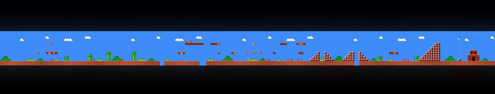

# Platformers

## Platformer Analysis

*Due 2-19-25*

<p align="center">
    <picture>
        
    </picture>
</p>

Before we begin prototyping platformer mechanics, spend some time analyzing the differences between **3 platformer games** made before 1995. To find games, use google or whatever, but if you have trouble, choose from popular franchises like Super Mario or Sonic the Hedgehog. If you can play the games yourself, that is best, but if you don't have access, look on youtube search for the game's title and 'longplay' (e.g. "Mega Man X longplay").

For each game, address the following points:

- Describe the movement on the ground (pay attention to the details)
- Describe the jump (again, be detail oriented)
- How has the game's level design been influenced by these movement and jump mechanics?
- Include a screenshot of the game

Your analysis should be written as a file written in the [markdown format](https://github.com/adam-p/markdown-here/wiki/markdown-cheatsheet) titled `analysis.md` and it should be located in the following directory: `game-dev-spring2025/prototypes/platformer/`. Include at least a couple paragraphs per game.

Come to class prepared to discuss your analysis to the class. Your analysis should be posted before class at the following:

```
https://github.com/<YOUR_GITHUB_USERNAME>/game-dev-spring2025/tree/main/prototypes/platformer/analysis.md
```

## Platformer Controls - Round 1


*Due: 2-26-25*

Create a 2d or 3d platformer prototype that implements features [from this list](https://docs.google.com/spreadsheets/d/1RUum3ofbaDgzheoHGNz9Vk3W7qummd1S33_1BpcjhP4/edit?usp=sharing). Each item on the list has a suggested *"Implementation Difficulty Score"*. Make sure whatever you create adds up to a total of 3. Note that there is no score for basic platforming (moving and jumping). Feel free to start from this [code example](https://github.com/mtreanor/game615-spring2025/tree/main/examples/platformer/Assets/PlatformerPlayerController.cs).

Your prototype should have a small level that demonstrates the mechanics you implemented. Remember to primarily focus on your game mechanics (and not the visuals or effects).

Your game should be playable at the following link:

```
http://<YOUR_GITHUB_USERNAME>.github.io/game-dev-spring2025/builds/platformer-1
```

## Final Platformer and Reflection

*Due 3-19-25*

First, make whatever final tweaks to your platformer you intend to make. Your final version should be playable at:

```
http://<YOUR_GITHUB_USERNAME>.github.io/game-dev-spring2025/builds/platformer-final
```

Next, reflect on your experience creating the platformer prototypes. For each prototype, create a section with the folloling:

- What were you experimenting with with your prototype?
- What did you learn?
- Include an image of each prototype
- Include a link to each prototype

The README.md should be placed in the following directory of your repository: `game-dev-spring2025/prototypes/platformer`. If you did everything right, you should see your markdown file rendered as a basic website when you go the following link:

```
https://github.com/<YOUR_GITHUB_USERNAME>/game-dev-spring2025/tree/main/prototypes/platformer
```