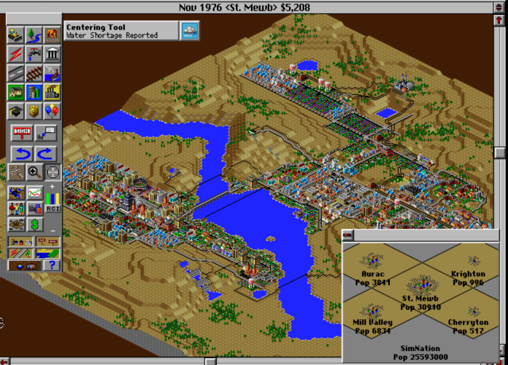

# Simulation

## A Grid-based Simulation - part 1

*Due 3-26-25*

<p align="right">
    <picture>
        
    </picture>
</p>

Create a grid-based simulation, where each cell in the grid has a state that evolves through input and time passing, and the state of each cell is visualized (however minimally) to the player in some way. 

The way that your simulation evolves should be determined by at least two competing *local* factors that the player has influence over somehow. By local factors, I mean that a cell should be updated based on the surrounding cells in some way. The player should be able directly change something about the cells to influence these. By *competing*, I mean that there should be some factor that causes a state value to go up, and some other factor that causes it to go down.

As an example, consider a world where cells have a notion of the "happiness" of the cell's inhabitants. The happiness score goes up if the cell can reach a "park" via a "road" (you could imagine a number of pathplanning ways to determine this ranging from simple to complex). The player can place the roads. The happiness value of the cell is also negatively influenced by the "pollution" of the world. The pollution value is determined by how many roads there are. In this way, happiness is influenced by two competing factors: parks and roads. 

Note that you may not want to use roads/path planning at this point, and elect to simulate something simpler. In fact, I encourage you to think simply at this point.

Your game should be playable at the following link:

```
http://<YOUR_GITHUB_USERNAME>.github.io/game-dev-spring2025/builds/simulation-1
```